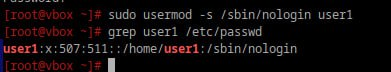

# Запрещаем

## 1. Запретите пользователю user1 из предыдщуего задания выполнять вход в систему

```bash
sudo usermod -s /sbin/nologin user1
```
<div style="text-align: left;">
  
</div>

## 2. Как вы это сделали?

Смена оболочки:  
- -s - параметр для указания оболочки пользователя.
- /sbin/nologin - специальная оболочка (shell), используемая для запрета пользователю входа в систему. 

При попытке входа пользователь увидит сообщение о недоступности учётной записи.

## 3. Какие ещё способы это сделать вы знаете?

Это можо сделать еще с помощью лвух способов:

- Использовать passwd -l. 

Это действие делает пароль пользователя невалидным, и пользователь не сможет войти в систему, даже если он знает свой пароль.

```bash
sudo passwd -l user1
```

- Использование /bin/false в качестве оболочки.

/bin/false также можно назначить пользователю как оболочку. Это также блокирует доступ пользователя в систему, но в отличие от /sbin/nologin, не выводится сообщение о запрете входа — просто сессия будет завершена с кодом ошибки.

```bash
sudo usermod -s /bin/false user1
```
## 4. Можно ли создать пользователей с одинаковыми username?

Нельзя, так как каждое имя в системе должно быть уникальным. 

В файле /etc/passwd каждая запись идентифицируется при помощи уникальности имени пользователя.
