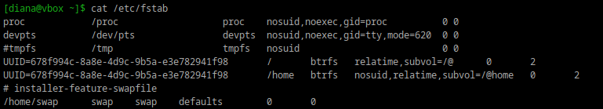
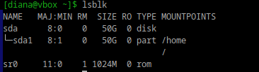
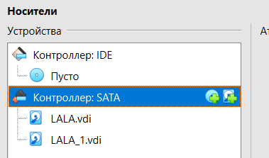
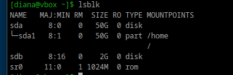
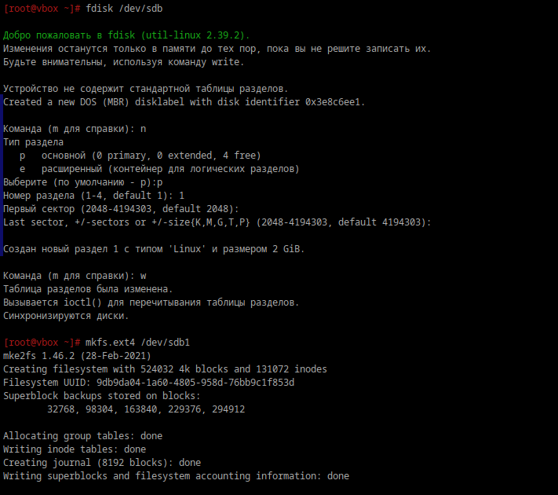
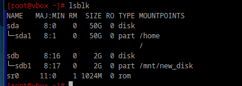
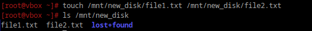
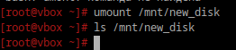
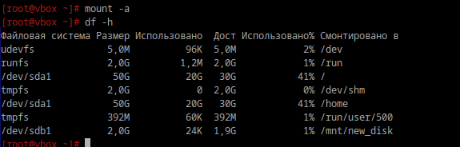
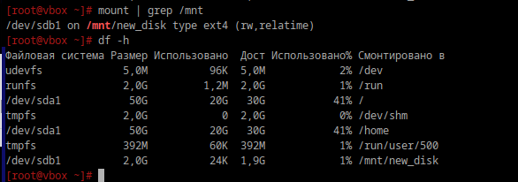

# Продолжаем

## 1. Выведите содержимое fstab. Что хранится в fstab?

fstab (File System Table) — это конфигурационный файл в котором хранятся утройства, которые должны быть автоматически монтированы при старте системы.

```bash
cat /etc/fstab
```

<div style="text-align: left;">
  
</div>

Текущие диски:

<div style="text-align: left;">
  
</div>

## 2. Добавьте в виртуальную машину ещё один диск

<div style="text-align: left;">
  
</div>

## 3. Узнайте как сиcтема видит ваш диск - выведите информацию о блочных устройствах

<div style="text-align: left;">
  
</div>

## 4. С помощью полученной информации создайте на диске таблицу разделов и фаловую систему ext4

```bash
fdisk /dev/sdb
mkfs.ext4 /dev/sdb1
```

<div style="text-align: left;">
  
</div>

## 5. Примонитруте диск в каталог /mnt

Создать точку монтирования:

```bash
mkdir /mnt/new_disk
```

Смонтировать новый раздел на эту точку монтирования:

```bash
mount /dev/sdb1 /mnt/new_disk
```

<div style="text-align: left;">
  
</div>

## 6. Зайдите в каталог и создайте там файлы

```bash
touch /mnt/new_disk/file1.txt /mnt/new_disk/file2.txt
```

<div style="text-align: left;">
  
</div>

## 7. Отмонтируйте диск и проверье остались ли файлы

```bash
umount /mnt/new_disk
```

<div style="text-align: left;">
  
</div>

Неа, не остались.

## 8. Сделайте так чтобы диск автоматически подключался при загрузке систем ( добавьте информацию о нём с fstab)

```bash
nano /etc/fstab
/dev/sdb1  /mnt/new_disk  ext4  defaults  0  2
```

- /dev/sdb1: - путь к новому диску.
- /mnt/new_disk: - точка монтирования.
- ext4: - файловая система.
- defaults: - стандартные параметры монтирования.
- 0: поле для бэкапов, обычно 0.
- 2: поле для проверки дисков в процессе загрузки системы (обычно 2 для вторичных дисков).

## 9. Проверьте корретность записанных в fstab данных перед перезагрузкой.

```bash
mount -a
df -h
```

<div style="text-align: left;">
  
</div>

## 10. Перезагрущите систему и убедитесь что диск был подключён к системе.

```bash
mount | grep /mnt
df -h
```

<div style="text-align: left;">
  
</div>