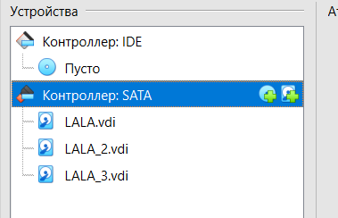
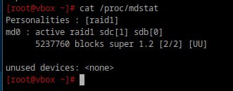

# Продолжаем

## 1. Raid массивы, что такое икакие бывают

RAID — это технология объединения нескольких физических дисков в один логический массив. Это делается для достижения одной или нескольких целей: повышение производительности, повышение отказоустойчивости (избыточность), увеличение объема хранения.

- RAID 0 (Striping): данные распределяются по всем дискам без избыточности. Увеличивает скорость и ёмкость, но данные теряются при выходе из строя одного диска.
- RAID 1 (Mirroring): данные дублируются на все диски. Обеспечивает высокую отказоустойчивость, но использует половину доступной ёмкости.
- RAID 5: распределение данных с использованием контрольных сумм (parity). Требует минимум 3 дисков. Обеспечивает баланс между производительностью, ёмкостью и отказоустойчивостью.
- RAID 6: то же, что и RAID 5, но с дополнительной избыточностью (два блока контрольных сумм). Требует минимум 4 дисков.
- RAID 10 (или 1+0): комбинация RAID 1 и RAID 0. Использует зеркалирование и распределение данных. Требует минимум 4 дисков.

## 2. Добавьте в виртуальную машину 2 диска отформатируйте их в ext4

<div style="text-align: left;">
  
</div>

```bash
mkfs.ext4 /dev/sda
mkfs.ext4 /dev/sdc
```

## 3. Создайте из них raid 0 массив

```bash
mdadm --create /dev/md0 --level=0 --raid-devices=2 /dev/sda /dev/sdc
```

- /dev/md0 — это имя нового RAID массива.
- --level=0 — это уровень RAID 0.
- --raid-devices=2 — это количество устройств в массиве (2 диска).

```bash
mkfs.ext4 /dev/md0
```

```bash
mkdir /mnt/raid0
mount /dev/md0 /mnt/raid0
```

## 4. Проверьте всё ли работает

```bash
df -h
cat /proc/mdstat
```

## 5. Удалите raid0 и создайте raid1

```bash
umount /mnt/raid0
mdadm --stop /dev/md0
```

```bash
mdadm --remove /dev/md0
```


```bash
wipefs --all /dev/sda
wipefs --all /dev/sdc
```


```bash
mdadm --create /dev/md0 --level=1 --raid-devices=2 /dev/sda /dev/sdc
```

<div style="text-align: left;">
  
</div>


## 6. В чём между ними разница?

RAID 0 (чередование) и RAID 1 (зеркалирование) — это два разных способа объединения нескольких физических дисков в один логический том. Основная разница между ними заключается в том, на что делается упор: производительность или надежность.

RAID 0:

Плюсы: высокая скорость записи и чтения, увеличение доступного объёма.
Минусы: при выходе из строя одного диска данные теряются.

RAID 1:

Плюсы: высокая отказоустойчивость (данные сохраняются, если один диск выйдет из строя).
Минусы: используется только половина общего объёма дисков.

## 7. Есть ли файловые системы которые поддерживают raid массивы без стороненго ПО

Да, есть. Наиболее известная — ZFS. Она объединяет файловую систему и менеджер томов, поэтому умеет создавать RAID-массивы (RAID-Z1, Z2, Z3) без дополнительного ПО. Также есть Btrfs, но она менее распространена для RAID.

## 8. Можно ли создать raid массив во время установки системы?

Можно.
