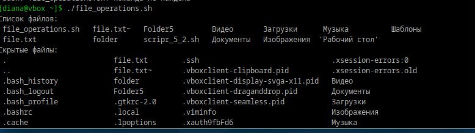
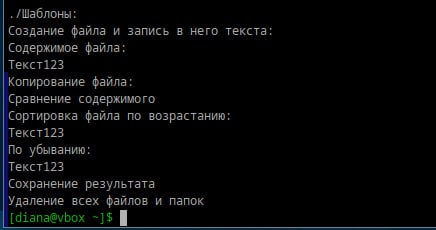

# Скриптуем по полной

## 1. Что такое шебанг?

Шебанг — строка, начинающаяся с символов #!, которая играет важную роль в запуске скриптов. Шебанг указывает операционной системе, какой интерпретатор нужно использовать для выполнения скрипта.

## 2. Обязательно ли исполняемый файл дожен иметь соотвествующее расширение?

Неа, необязательно. Главное, что должно быть у исполняемого файла — это право на выполнение и, как правило, шебанг.

## 3. Напишите скрипт который выполнит автоматически действия из блока работы с файлами. ( не забудьте включить set -euo pipefail для того что бы ваш скрипт было удобнее отлаживать. Опишите что включают эти флаги)

```bash
chmod +x file_operations.sh
```

```bash
#!/bin/bash
set -euo pipefail

# -e: Остановить выполнение скрипта при любой ошибке (ненулевой код возврата).
# -u: Прекратить выполнение при использовании необъявленных переменных.
# -o pipefail: В конвейере (|) если хотя бы одна команда вернёт ошибку, весь конвейер считается ошибочным.


# 1. Переместиться в директорию
cd /home/diana/

# 2. Вывести список файлов в директории
echo "Список файлов:"
ls
echo "Скрытые файлы:"
ls -a
echo "Подробный список со скрытыми файлами:"
ls -la

# 3. Вывести список всех файлов в директории (включая подпапки)
echo "Список всех файлов в директории:"
ls -R

# 4. Создать папку с подпапками
mkdir -p new_folder/two_folder

# 5. Создать файл внутри папки и записать в него содержимое
echo "Создание файла и запись в него текста:"
touch new_folder/two_folder/file.txt
echo "Текст123" > new_folder/two_folder/file.txt
echo "Содержимое файла:"
cat new_folder/two_folder/file.txt

# 6. Переместить файл из одной директории в другую
mv new_folder/two_folder/file.txt new_folder/

# 7. Скопировать файл из одной директории в другую
echo "Копирование файла:"
cp new_folder/file.txt new_folder/two_folder/

# 8. Переименовать файл
mv new_folder/file.txt new_folder/renamefile.txt

# 9. Сравнить содержимое файлов
echo "Сравнение содержимого"
diff new_folder/renamefile.txt new_folder/two_folder/file.txt

# 10. Отсортировать содержимое файла
echo "Сортировка файла по возрастанию: "
sort new_folder/two_folder/file.txt
echo "По убыванию: "
sort -r new_folder/two_folder/file.txt
echo "Сохранение результата"
sort new_folder/two_folder/file.txt > new_folder/two_folder/sortedfile.txt

# 11. Удалить все папки и файлы
echo "Удаление всех файлов и папок"
rm -rf new_folder
```

<div style="text-align: left;">
  
</div>

<div style="text-align: left;">
  
</div>