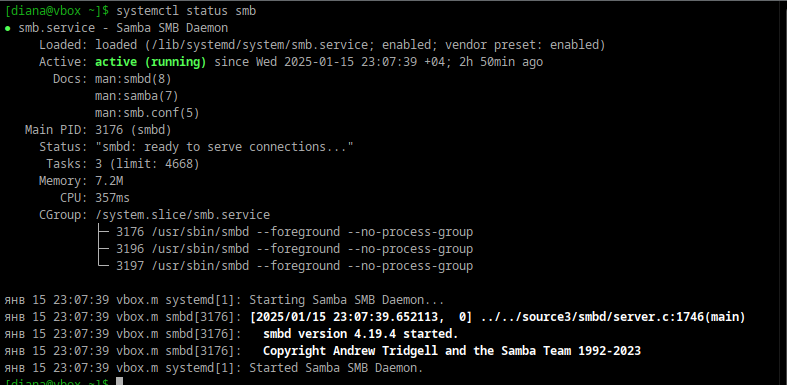
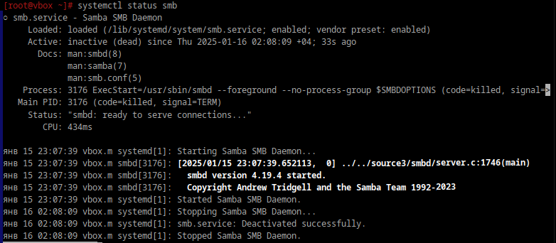
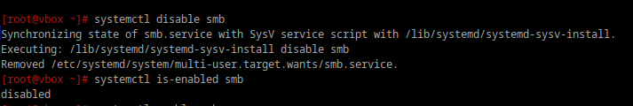
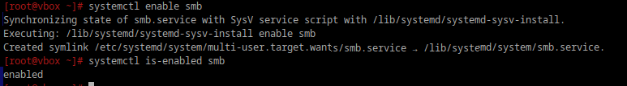

# Юниты

## 1. Что такое systemd юнит?

**Systemd юнит** — это конфигурационный файл, который systemd использует для управления процессами, сервисами и другими компонентами системы.


## 2. Проверье статус любого systemd юнита, какую информацию выводит эта кманда?

```bash
systemctl status smb
```

Выводится нформация о службе Samba SMB Daemon (smb.service):

<div style="text-align: center;">
  
</div>


###  1. Основная информация
- **Имя службы:** `smb.service`
- **Описание:** Samba SMB Daemon

### 2. Статус загрузки
- **Loaded:** Загружена из файла конфигурации `/lib/systemd/system/smb.service`.
- **Автозагрузка:** `enabled` (служба настроена на автоматический запуск при старте системы).

### 3. Активность
- **Active:** Активна и работает (статус `running`).
- **Время запуска:** `2025/01/16 00:17:53`.

### 4. Документация
- [man:smbd(8)](man:smbd(8)) — справочник по демону `smbd`.
- [man:samba(7)](man:samba(7)) — справочник по пакету Samba.
- [man:smb.conf(5)](man:smb.conf(5)) — справочник по конфигурационному файлу Samba.

### 5. Основной процесс
- **Main PID:** `3143` (выполняет `smbd`).
- **Status:** `"smbd: ready to serve connections..."`.

### 6. Ресурсы

### 7. Логи


## 3. Попробуйте оставновить сервис.

```bash
sudo systemctl stop smb
```

Результат:

<div style="text-align: center;">
  
</div>


## 4. Перезапустите его.

```bash
sudo systemctl restart smb # Вновь стал active
```


## 5. Удалите из автозагрузки

```bash
systemctl disable smb
systemctl is-enabled smb 
```

<div style="text-align: center;">
  
</div>

6. Верните обратно
```bash
systemctl enable smb
systemctl is-enabled smb 
```

<div style="text-align: center;">
  
</div>


## 7. Что такое таймеры?

Timer — активация других единиц по таймеру, предоставляет функционал, похожий на сron(Запускатор чего-либо в определённый промежуток веремени т.е по таймеру).

Таймеры в systemd — это мощный механизм для планирования задач, который предоставляет функциональность, аналогичную cron, но с более тесной интеграцией с другими компонентами systemd. Они позволяют запускать сервисы, скрипты или другие юниты systemd по расписанию или после наступления определенных событий.


Cron — это инструмент планирования задач в Unix-подобных системах. Он позволяет запускать команды или скрипты в заданное время, по расписанию или через определенные интервалы. Использует crontab — файл конфигурации, где указывается, когда и какие команды нужно запускать.
