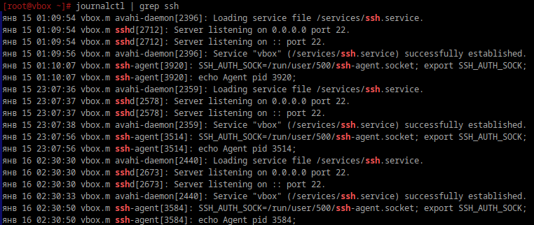
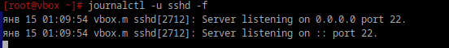
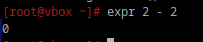

# Журнальчики

## 1. Посмотретите журналы ssh

```bush
journalctl | grep ssh
```
P.S. `grep ssh` ищет в этом выводе строки, содержащие слово ssh.

<div style="text-align: left;">
  
</div>

## 2. Выведите журналы в реальном времени

```bush
journalctl -f | grep ssh
```

## 3. Выведите лог в реальном времени для службы sshd

```bush
journalctl -u sshd -f
```

<div style="text-align: left;">
  
</div>

## 4. Можно ли без комады journalctl прочитать логи systemd?

Да, можно. 

```bush
strings /var/log/journal/machine-id/system.journal
```
Где machine-id - айди машины, который можно получить через `cat /etc/machine-id`.


## 5. Сколько будет 2-2?

```bush
expr 2 - 2
```

<div style="text-align: left;">
  
</div>

Мой ответ - 0
