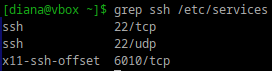
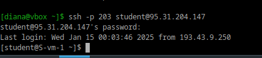
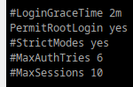
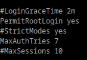
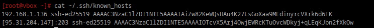

# Настриваем

## 1. Какой по умолчанию используется порт для поключения?

По умолчанию используется 22 порт.

```bash
grep ssh /etc/services 
```

<div style="text-align: left;">
  
</div>


## 2. Можно ли его изменить? если да то как?

Это можно сделать отредактировав конфигурационный файл.

## 3. Какая служба отвечает за обработку запросов на подключения по ssh?

За это отвечает служба sshd.

## 4. Какой файл конфигурации отвечает за его настройку?

```bash
/etc/ssh/sshd_config
```

## 5. Попробуйте подключиться по ssh к предоставленному вам серверу

Шаблон:
```bash
ssh -p port_number username@server_ip_or_domain
```

Моё:
```bash
ssh -p 203 student@95.31.204.147
```

 <div style="text-align: left;">
  
</div>

## 6. Отредактируйте файл настроек на сервере так, чтобы была возможность подключиться к серверу используя пользователя root

КАК Я НАМУЧИЛАСЬ С ЭТОЙ ШТУКОЙ

```bash
sudo vi /etc/openssh/sshd_config
```

Поменять строку #PermitRootLogin prohibit-password на PermitRootLogin yes

Потом перезупустить службу sshd

```baash
sudo systemctl restart sshd
```

## 7. Измените колличество ошибок ввода пароля перед сборосом соединения, покажите эти измененения

```bash
sudo vi /etc/openssh/sshd_config
```

Находим MaxAuthTries, убираем # и изменяем количество попыток.

Исходный:

 <div style="text-align: left;">
  
</div>

Изменили:

 <div style="text-align: left;">
  
</div>


## 8. Создайте пользователя ssh-user и попробуйте им подключиться к серверу

Создаем и задаем пароль:

```bash
sudo adduser ssh-user
sudo passwd ssh-user
```

А далее уже подключаемся:

```bash
ssh -p 203 ssh-user@95.31.204.147
```

DenyUsers ssh-user
## 9. Ограничте ему возможность подключения к серверу

```bash
vi /etc/openssh/sshd_config
```
После чего нужно добавить DenyUsers ssh-user.

## 10. Как вы это сделали?

Выше написано вроде...

## 11. Что хранится в файле known_hosts?

```bash
~/.ssh/known_hosts
```

В файле known_hosts хранятся публичные ключи серверов, с которыми устанавливались SSH-соединения.

Когда подключаешься к серверу через SSH, его публичный ключ сохраняется в этом файле на клиенте. При последующих подключениях SSH проверяет, совпадает ли публичный ключ сервера с тем, что хранится в known_hosts, чтобы убедиться, что сервер не изменился.

 <div style="text-align: left;">
  
</div>