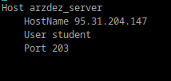
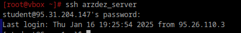

# Конфижим для удобства

## 1. Где хранятся пользвательские и системные настройки подключения?

- Системные настройки: /etc/openssh/ssh_config.

- Пользовательские настройки: ~/.ssh/config.

## 2. Что за файл options?

Файл options — это общее название для файлов, используемых для хранения настроек и параметров различных программ и служб.

Но если брать SSH, то там отдельного файла options для основных настроек обычно нет (вроде как). Там всё хранится в других файлах, про которые
 был выше вопрос.

 ```bash
find / -name "options" 2>/dev/null
```

## 3. Отредактируйте файл options так, чтобы можно было подключаться не вводя имя пользвателя и порт

```bash
nano ~/.ssh/config
```
Вставила туда

 <div style="text-align: left;">
  
</div>

## 4. Назовите подключение удобным для вас спсобом

Назвала его arzdez_server.

## 5. Проверьте работоспособность

 <div style="text-align: left;">
  
</div>

Я забыла, что там пароль в файле находится, и минут пять возилась, думала:"Черт, неужели опять какой-то пароль забыла".