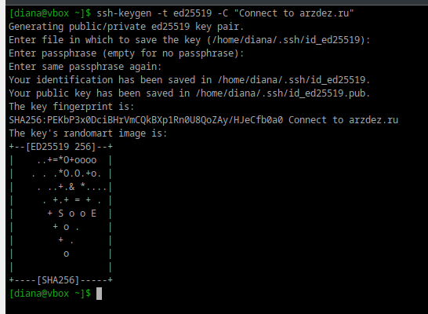
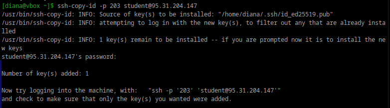
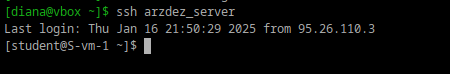
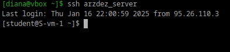

# Ключики

## 1. Что такое ssh ключи и зачем они нужны?

SSH-ключи — это способ аутентификации пользователя на удаленном сервере по протоколу SSH без использования пароля. Они представляют собой пару криптографически связанных ключей: закрытый и открытый.

- Закрытый ключ хранится клиентом и должен быть абсолютно защищен. Любое нарушение безопасности закрытого ключа позволит злоумышленникам входить на серверы с соответствующим открытым ключом без дополнительной аутентификации. В качестве дополнительной меры предосторожности ключ можно зашифровать на диске с помощью парольной фразы.

- Соответствующий открытый ключ можно свободно передавать, не опасаясь негативных последствий. Открытый ключ можно использовать для шифрования сообщений, расшифровать которые можно только с помощью открытого ключа. Это свойство применяется как способ аутентификации с использованием пары ключей.Открытый ключ выгружается на удаленный сервер, на который вы хотите заходить, используя SSH.


## 2. Как их создать?

```bash
ssh-keygen
```

## 3. Создайте пару публичный/приватный ключ ed_25519, где они хранятся?

```bash
ssh-keygen -t ed25519 -C "student@arzdez.ru"
```

- t - тип ключа
- С - комментарий

 <div style="text-align: left;">
  
</div>

Сохранились в:

```bash
Your identification has been saved in /home/diana/.ssh/id_ed25519.
Your public key has been saved in /home/diana/.ssh/id_ed25519.pub.
```

## 4. Скопируйте публичный ключ на ваш сервер, в каком файле он будет храниться?

```bash
ssh-copy-id -p 206 student@95.31.204.147
```
 <div style="text-align: left;">
  
</div>

## 5. Попробуйте подключиться к серверу, у вас запросили пароль?

Неа, не запросили.

 <div style="text-align: left;">
  
</div>

## 6. Запретите подключение с паролем для всех пользователей, оставьте только с помощью ключа.

```bash
sudo nano /etc/openssh/sshd_config
```

Вставляем:

```bash
PubkeyAuthentication yes # Разрешить с помощью ключей
PasswordAuthentication no # Запретить с помощью пароля
ChallengeResponseAuthentication no # Запретить другие способы
```

 <div style="text-align: left;">
  
</div>
