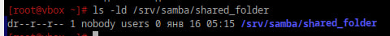
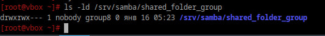
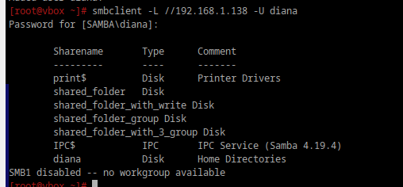
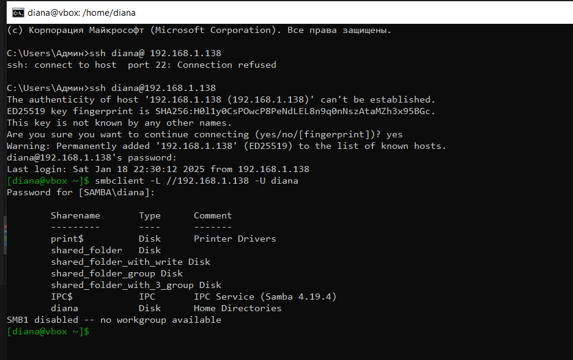

# Шарим


## 1. Установите пакет samba

```bash
apt-get install samba
```

## 2. Что такое побщая папка, зачем оно может быть нужно?

Общая папка — это папка, доступ к которой могут иметь несколько пользователей или устройства через сеть (Даже через другие ОС).

## 3. Создайте общую папку без пароля с правами только на чтение файлов

```bash
mkdir -p /srv/samba/shared_folder
chmod 444 /srv/samba/shared_folder
```

```bash
chown -R nobody:users /srv/samba/shared_folder
```


```bash
nano /etc/samba/smb.conf

```
```ini
[shared_folder]
   path = /srv/samba/shared_folder
   browsable = yes
   read only = yes
   guest ok = yes
   force user = nobody
```

[shared_folder]
   path = /srv/samba/shared_folder
   browsable = yes
   read only = no
   guest ok = yes
   valid users = diana


```bash
systemctl restart smb
```

```bash
ls -ld /srv/samba/shared_folder
```

(Для всех чтение)
<div style="text-align: left;">
  
</div>

## 4. Создайте общую папку с паролем с правами на чтение и запись

```bash
mkdir -p /srv/samba/shared_folder_with_write
chmod 755 /srv/samba/shared_folder_with_write
```
```bash
chown -R nobody:users /srv/samba/shared_folder_with_write
```

```bash
nano /etc/samba/smb.conf
```

```ini
[shared_folder_with_write]
   path = /srv/samba/shared_folder_with_write
   browsable = yes
   read only = no
   guest ok = no
   valid users = diana

```

```bash
systemctl restart smb
```

```bash
ls -ld /srv/samba/shared_folder_with_write
```
<div style="text-align: center;">
  
</div>


## 5. Создайте общую папку с доступом для какой-то группы с полными правами

```bash
mkdir -p /srv/samba/shared_folder_group
chmod 770 /srv/samba/shared_folder_group
```

```bash
groupadd group8
chown nobody:group8 /srv/samba/shared_folder_group
```

```bash
nano /etc/samba/smb.conf
```

```ini
[shared_folder_group]
   path = /srv/samba/shared_folder_group
   browsable = yes
   read only = no
   guest ok = no
   valid users = @group8
```

```bash
usermod -aG group8 diana
```

```bash
systemctl restart smb
```

```bash
ls -ld /srv/samba/shared_folder_group
```

<div style="text-align: left;">
  
</div>


## 6. Создайте общую папку в которой у одной группы будет полный доступ, а у другой только доступ на чтение.

```bash
useradd user_samba_1
useradd user_samba_2
useradd user_samba_3
```

```bash
passwd user_samba_1
passwd user_samba_2
passwd user_samba_3
```

```bash
groupadd full_access
groupadd read_only
groupadd no_access
```

```bash
usermod -aG full_access user_samba_1
usermod -aG read_only user_samba_2
usermod -aG no_access user_samba_3
```

```bash
mkdir -p /srv/samba/shared_folder_with_3_group
chmod 770 /srv/samba/shared_folder_with_3_group
```

```bash
nano /etc/samba/smb.conf
```

```ini
[shared_folder_with_3_group]
    path = /srv/samba/shared_folder_with_3_group
    browsable = yes
    guest ok = no
    valid users = @full_access, @read_only, @no_access
    writeable = yes
    read only = no
    create mask = 0775
    directory mask = 0775

    # Права доступа для full_access (полный доступ)
    force group = full_access
    valid users = @full_access
    writeable = yes

    # Права доступа для read_only (только чтение)
    valid users = @read_only
    read only = yes
```

```bash
systemctl restart smb
```


```bash
smbclient -L //192.168.1.138 -U diana
```

<div style="text-align: left;">
  
</div>

```bash
ssh diana@192.168.1.138
```
Подключение с винды:

<div style="text-align: left;">
  
</div>
