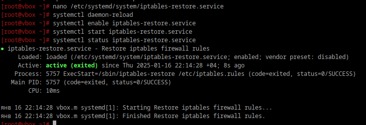

# Открываем iptables

## 1. Установите iptables

```bash
sudo apt-get install iptables
```

## 2. Проверьте осталась ли возможность подключения по ssh к вашему серверу


```bash
ssh arzdez_server
```

Да, осталась.


## 3. Почему может пропасть такая возможность?

Ошибка с сетью, перезагрузка, сбой сервера, могут заблокироваться входящие соединенияна на 22 порт, который по умолчанию использует ssh.


## 4. Откройте нужный порт на сервере чтобы восстановить подключение

```bash
iptables -A INPUT -p tcp --dport 203 -j ACCEPT
```

- `-A` - append (Добавить)
- `INPUT` - цепочка для входящих пакетов (правило)
- `-A INPUT` - добавляет правило в цепочку входящих пакетов
- `-p` - указывает протокол, который будет использоваться для фильтрации пакетов
- `tcp` - тип протокола
- `--dport` - указывает целевой порт
- `-j` - действие, которое будет выполнено для пакетов
- `ACCEPT` - пакеты, удовлетворяющие этому правилу (входящие TCP-соединения на порт 206), будут разрешены, то есть, они смогут пройти через фаервол.


# 5. Это будет udp или tcp прот?

Это будет tcp, т.к ssh использует tcp протокол для установления соединений.


# Сохраняем

## 6. Сохраняются ли записанные вами правила после перезагрузки?

Неа.

## 7. Как их сохранить?

```bash
iptables-save  > /etc/iptables.rules
```

```bash
nano /etc/systemd/system/iptables-restore.service
```

```ini
[Unit]
Description=Restore iptables firewall rules
After=network-pre.target
Wants=network-pre.target

[Service]
Type=oneshot
ExecStart=/sbin/iptables-restore /etc/iptables.rules
# (which iptables-restore) - чтобы найти путь
RemainAfterExit=yes

[Install]
WantedBy=multi-user.target
```

- `ExecStart` — команда, которая восстанавливает правила iptables из файла `/etc/iptables.rules`.
- `RemainAfterExit` — сохраняет статус активным после выполнения команды.
- `WantedBy=multi-user.target` — сервис активируется в многопользовательском режиме.

```bash
systemctl daemon-reload
```

```bash
systemctl enable iptables-restore.service
systemctl start iptables-restore.service
```
```bash
systemctl status iptables-restore.service
```

<div style="text-align: left;">
  
</div>
