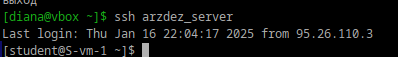
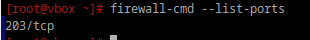
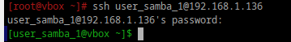

# Открываем firewald

## 1. Удалите iptables и установите firewalld
```bash
sudo apt-get remove iptables
sudo apt-get install firewalld
```
## 2. Попробуйте также проверить возможность подключения по ssh

<div style="text-align: left;">
  
</div>

Вышло.

## 3. Если её нет то откройте порт

Для начала мне пришлось запустить:

```bash
systemctl start firewalld
```
Затем:

```bash
firewall-cmd --zone=public --add-port=214/tcp --permanent
```

После этого нужно применить изменения:

```bash
firewall-cmd --reload
```


## 4. Выведите список открытых портов с помощью firewall-cmd

```bash
firewall-cmd --list-ports
```

<div style="text-align: left;">
  
</div>

## 5. Можно ли там добавить порты по названию сервиса?

Можно.

```bash
firewall-cmd --add-service=ssh --permanent
firewall-cmd --reload
```


## 6. На вашей Локальной виртуальной машине попробуйте подключиться к серверу samba из предыдущих заданий

<div style="text-align: left;">
  
</div>

## 7. Если не получилось то откройте нужные порты

```bash
firewall-cmd --add-service=samba --permanent
firewall-cmd --reload
```


## 8. Сделайте так чтобы изменения были постоянными


Когда  используешь  параметр `--permanent` в команде `firewall-cmd`, изменения сохраняются в конфигурации `firewalld`, и они остаются действительными после перезагрузки системы.(Пункт 7)

