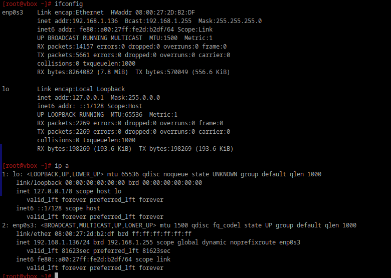
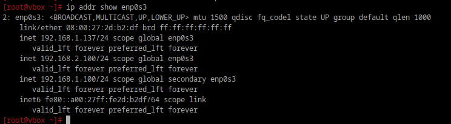
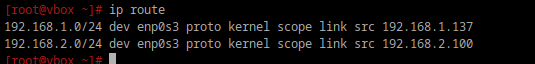
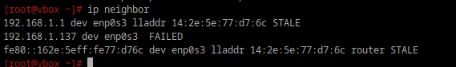

# Cети
## 1. Выведите список интерфейсов, какими способами можно это сделать?

```bash
ifconfig
ip a
```

<div style="text-align: left;">
  
</div>

## 2. Попробуйте изменить ip адрес.

```bash
ip addr add 192.168.1.136/24 dev enp0s3
```

```bash
ip addr del 192.168.1.137/24 dev enp0s3 
```

## 3. Попробуйте добавить несколько ip адресов на сетевую карту.

```bash
ip addr add 192.168.1.100/24 dev enp0s3
ip addr add 192.168.2.100/24 dev enp0s3
```

```bash
ip addr show enp0s3
```
<div style="text-align: left;">
  
</div>


## 4. Выведите список маршрутов.

```bash
ip route
```

<div style="text-align: left;">
  
</div>

## 5. Выведите arp таблицу.

```bash
ip neighbor
```

<div style="text-align: left;">
  
</div>


## 6. Что такое ip адрес?

IP-адрес — это уникальный числовой идентификатор устройства в компьютерной сети, работающей по протоколу IP. Он позволяет устройствам общаться друг с другом в локальной сети или в интернете.

## 7. Для чего нужны маршруты?

Маршруты в компьютерных сетях, и в частности в интернете, играют ключевую роль в доставке данных от отправителя к получателю. Они определяют путь, по которому пакеты данных перемещаются между различными сетями.

## 8. Что за протокол arp?

Протокол ARP (Address Resolution Protocol) используется для преобразования сетевых адресов уровня IP (например, IPv4) в физические MAC-адреса, которые необходимы для передачи данных в пределах локальной сети. Когда устройство хочет отправить данные в сеть и знает только IP-адрес получателя, оно использует ARP для запроса MAC-адреса устройства, которое соответствует этому IP-адресу. Ответ на запрос позволяет устройству направить данные на правильный физический адрес.


## 9. Что такое dhcp?

DHCP (Dynamic Host Configuration Protocol) — это сетевой протокол, который автоматически назначает IP-адреса и другие настройки (например, маску подсети, шлюз по умолчанию, DNS-серверы) устройствам в сети. Когда устройство подключается к сети, сервер DHCP присваивает ему уникальный IP-адрес из заранее определённого пула, что упрощает управление сетью и исключает необходимость вручную настраивать каждый клиент.

## 10. Что такое dns?

DNS — это как телефонная книга для интернета. Она преобразует понятные человеку доменные имена в числовые IP-адреса, которые используют компьютеры для связи друг с другом.

## 11. Как называется один из протоколов синхронизации времени?

NTP - используется для синхронизации времени между компьютерами в сети через интернет или локальные сети.

## 12. Что такое широковещательный запрос, зачем он нужен?

Широковещательный запрос (broadcast request) — это способ передачи данных в компьютерной сети, при котором сообщение отправляется всем устройствам в локальной сети. Он используется для обнаружения устройств или сервисов, например, в протоколах DHCP и ARP, где необходимо найти устройства по IP-адресу или получить настройки сети.

## 13. Какой адресс является широковещательным?

Широковещательным адресом для IPv4 является **255.255.255.255**, который используется для отправки сообщений всем устройствам в локальной сети.

В пределах конкретной сети широковещательный адрес — это такой адрес, где все части, относящиеся к устройствам в сети, равны единице.

## 14. Какие ещё параметры можно задать сетевой карте?
- MAC-адрес — уникальный идентификатор устройства в сети.
- DNS-серверы — адреса серверов, которые выполняют разрешение доменных имен.
- MTU (Maximum Transmission Unit) — максимальный размер пакета, который может быть передан по сети.
- Тип подключения — можно настроить режим работы (например, статический или динамический IP)..
- IPv6-адреса — поддержка и настройка IPv6.

## 15. Что такое маска подсети? зачем она нужна?
Маска подсети — это 32-битное число (в IPv4), которое используется для разделения IP-адреса на две части:

Адрес сети (Network ID или Network Address): Эта часть IP-адреса идентифицирует конкретную сеть. Все устройства в одной сети имеют одинаковый адрес сети.
Адрес хоста (Host ID или Host Address): Эта часть IP-адреса идентифицирует конкретное устройство внутри этой сети. Каждое устройство в сети должно иметь уникальный адрес хоста.

Основная задача маски подсети — помочь устройствам и маршрутизаторам определить, находится ли другое устройство в той же локальной сети или в другой. Это критически важно для правильной доставки данных.